# **The Complete Design Tokens Sync Process: From Figma to Code**

*A comprehensive guide to syncing design tokens between Figma Token Studio and your React application*

---

## **What Are Design Tokens?**

**Design tokens** are the smallest pieces of a design system—think colors, font sizes, spacing, border radii, shadows, etc.—stored in a standardized format that both designers and developers can use. Instead of hardcoding values like `#00b140` for a color, you use a semantic token like `color-primary-500`.

Think of design tokens as the **single source of truth** for all your design decisions, ensuring perfect consistency between what designers create in Figma and what developers build in code.

---

## **Why Sync Tokens Between Figma and Code?**

- **🎯 Consistency**: Ensures identical colors, spacing, and typography across design and development
- **⚡ Efficiency**: Changes in Figma automatically propagate to code, eliminating manual updates
- **🚀 Scalability**: Makes it trivial to update themes, rebrand, or support multiple brands
- **🔄 Real-time Collaboration**: Designers and developers stay in sync without constant communication
- **📱 Multi-platform**: Same tokens can generate CSS, iOS, Android, and other platform styles

---

## **The High-Level Sync Flow**

```mermaid
graph TD
    A[👨‍🎨 Designer creates tokens in Figma] --> B[🔌 Token Studio plugin]
    B --> C[📄 Export tokens.json]
    C --> D[📁 Place in project root]
    D --> E[🤖 Run sync script]
    E --> F[📝 Generate CSS variables]
    E --> G[⚙️ Update Tailwind config]
    E --> H[🎨 Update React components]
    F --> I[✅ Your app uses synced tokens!]
    G --> I
    H --> I
```



---

## **Your Project's Token Architecture**

Your project has a sophisticated, multi-layered token system:

### **Key Files & Their Roles**

| File | Purpose | Generated? |
|------|---------|------------|
| `tokens.json` | **Source of truth** - exported from Figma Token Studio | ❌ Manual |
| `src/styles/tokens.css` | CSS custom properties for direct use | ✅ Auto-generated |
| `tailwind.config.js` | Tailwind utility classes | ✅ Auto-generated |
| `src/utils/tokens-loader.ts` | React hook for JavaScript access | ❌ Manual |
| `scripts/update-tokens.js` | **Main sync script** | ❌ Manual |
| `scripts/tokens-auto-sync.js` | Automation with git commits | ❌ Manual |

---

## **Step-by-Step: Complete Sync Process**

### **Step 1: Design in Figma with Token Studio**

**👨‍🎨 Designer Workflow:**

1. **Install Token Studio Plugin** in Figma
2. **Create token collections** for:
   - Colors (primary, secondary, neutral, etc.)
   - Spacing (0, 1, 2, 3... following your scale)
   - Typography (font families, sizes, weights)
   - Border radius (none, sm, md, lg, xl, etc.)
   - Opacity and shadows
3. **Use semantic naming** (see examples above)

---

### **Step 2: Sync Tokens from Figma to GitHub (Automatic or Manual)**

#### **A. Automatic Sync (Recommended)**

You can set up Token Studio to automatically push token changes to your GitHub repository whenever you update tokens in Figma. This eliminates the need to manually export and copy files.

**How to set up automatic sync:**

1. **Open Token Studio in Figma**
2. Go to the **Sync** or **GitHub Integration** tab (may be called "Remote" or "Repository" in some versions)
3. **Connect your GitHub account** and authorize Token Studio
4. **Select your repository** and the branch you want to sync to (e.g., `main` or `design-tokens`)
5. **Configure the file path** for your tokens file (e.g., `tokens.json` in the project root)
6. **Enable auto-push** or set up a manual push workflow as desired
7. **Save your configuration**

**Now, every time you update tokens in Figma and push via Token Studio, your `tokens.json` will be updated in GitHub automatically!**

> **Tip:** You can set up a dedicated branch for design tokens and use pull requests for review, or push directly to your main branch for instant updates.

#### **B. Manual Export (If not using auto-sync)**

1. **Export tokens**: Use Token Studio's export feature to download `tokens.json`
2. **Place the exported file** in your project root as `tokens.json`
3. **Commit and push** the updated file to your repository

---

### **Step 3: Automatic Local Sync (CI or Developer Machine)**

Whenever `tokens.json` changes (either via auto-sync or manual update), you should ensure your codebase stays up to date:

- **Option 1: Local Automation**
  - Use the provided script: `npm run tokens:sync` (runs validation, updates CSS/Tailwind, and auto-commits changes)
  - For continuous development, use: `npm run dev:tokens` (watches for changes and hot reloads)

- **Option 2: CI/CD Integration**
  - Add a CI job (e.g., GitHub Actions) that runs `npm run tokens:update` or `npm run tokens:sync` whenever `tokens.json` changes in the repository
  - This ensures that generated files (`tokens.css`, `tailwind.config.js`) are always up to date in your main branch

---

### **Step 4: Generated Output & Usage**

- **CSS Variables**: `src/styles/tokens.css` (auto-generated)
- **Tailwind Config**: `tailwind.config.js` (auto-generated)
- **React Hook**: `src/utils/tokens-loader.ts` (for dynamic access)

Use these tokens in your components as described in the next section.

---

**Summary of the Automated Flow:**

1. **Designer updates tokens in Figma**
2. **Token Studio pushes changes to GitHub** (auto or manual)
3. **Local/CI script detects `tokens.json` change and runs sync**
4. **Generated files are updated and committed**
5. **App and components instantly use the latest tokens**

> **Best Practice:** Automate as much as possible! With auto-sync and CI integration, your design and code will always be in perfect harmony.

---

## **5 Ways to Use Tokens in Your React Components**

Your project supports multiple methods for consuming design tokens:

### **Method 1: CSS Custom Properties**
```css
.my-button {
  background: var(--color-primary-500);
  padding: var(--spacing-4);
  border-radius: var(--border-radius-lg);
}
```

### **Method 2: Tailwind CSS Classes**
```jsx
<button className="bg-primary-500 p-4 rounded-lg">
  Click me
</button>
```

### **Method 3: React Hook (Dynamic Access)**
```jsx
import { useTokens } from '../utils/tokens-loader';

function MyComponent() {
  const { tokens, loading, error } = useTokens();
  
  if (loading) return <div>Loading tokens...</div>;
  
  return (
    <div style={{
      backgroundColor: tokens?.colors.primary?.['500'],
      padding: tokens?.spacing?.['4']
    }}>
      Dynamic token usage!
    </div>
  );
}
```

### **Method 4: Framer Motion with Tokens**
```jsx
import { motion } from 'framer-motion';
import { useTokens } from '../utils/tokens-loader';

function AnimatedComponent() {
  const { tokens } = useTokens();
  
  return (
    <motion.div
      style={{ backgroundColor: tokens?.colors.primary?.['500'] }}
      animate={{ scale: [1, 1.1, 1] }}
      transition={{ 
        duration: parseFloat(tokens?.transitions?.duration?.normal || '300ms') / 1000 
      }}
    >
      Animated with design tokens!
    </motion.div>
  );
}
```

### **Method 5: Style Generation Functions**
```jsx
import { generateButtonClasses } from '../utils/design-system';

function Button({ variant = 'primary', size = 'medium' }) {
  const classes = generateButtonClasses(variant, size);
  return <button className={classes}>Button</button>;
}
```

---

## **Advanced Features: Automation & Monitoring**

### **Auto-Sync with Git Integration**

The `tokens-auto-sync.js` script provides automated workflows:

```bash
npm run tokens:sync
```

**What it does:**
1. ✅ Validates and updates tokens
2. 🔍 Checks for git changes
3. 📝 Auto-commits changes with timestamp
4. 🚀 Optionally pushes to remote (configurable)

### **Development Mode with Hot Reloading**

```bash
npm run dev:tokens
```

**Benefits:**
- 👀 Watches `tokens.json` for changes
- 🔄 Auto-runs sync when file updates
- ⚡ Hot reloads your React app
- 🎯 Perfect for design handoff sessions

### **Real-Time Token Comparison**

Your app includes a design system manager that can:

```jsx
import { DesignSystemManager } from '../components/design-system/DesignSystemManager';

// Compare tokens.json vs TypeScript design system
const comparison = await tokensLoader.compareWithDesignSystem();
console.log(`${comparison.differences.length} differences found`);
```

---

## **Token Reference Resolution**

Your sync script handles complex token references automatically:

```json
{
  "borderRadius": {
    "3xl": { "value": "1.5rem", "type": "dimension" }
  },
  "spacing": {
    "6": { "value": "{3xl}", "type": "dimension" }
  }
}
```

**Result:** `spacing.6` automatically resolves to `1.5rem`

---

## **Error Handling & Validation**

The sync process includes comprehensive validation:

### **Required Token Categories**
- ✅ `colors` (required)
- ✅ `spacing` (required)  
- ⚙️ `borderRadius` (optional)
- ⚙️ `typography` (optional)
- ⚙️ `shadows` (optional)

### **Common Validation Errors**
```bash
❌ Missing required token category: colors
❌ Invalid type for spacing.4 (expected 'dimension')
❌ Missing value for color primary.500
⚠️  Token reference {nonexistent} not found
```

### **Validation Command**
```bash
npm run tokens:validate
```

---

## **Best Practices & Pro Tips**

### **🎯 Design Token Naming**

**DO:**
```json
{
  "colors": {
    "primary": { "500": "#00b140" },
    "semantic": { "success": "#00b140" }
  }
}
```

**DON'T:**
```json
{
  "green": "#00b140",
  "button-color": "#00b140"
}
```

### **🔄 Workflow Optimization**

1. **Use semantic references**: `{colors.primary.500}` instead of hardcoded values
2. **Set up file watching**: Use `npm run dev:tokens` during active design work
3. **Version control tokens**: Always commit `tokens.json` changes
4. **Document token usage**: Use the built-in `TokensShowcase` component

### **🚨 Common Pitfalls to Avoid**

- ❌ **Don't edit generated files** (`tokens.css`, `tailwind.config.js`)
- ❌ **Don't mix token sources** (stick to either `tokens.json` OR TypeScript)
- ❌ **Don't forget to run sync** after updating `tokens.json`
- ❌ **Don't use tokens for one-off values** (keep tokens semantic)

### **🔧 Troubleshooting**

**Token changes not appearing?**
1. Check if `tokens.json` is valid JSON
2. Run `npm run tokens:validate`
3. Verify the dev server restarted
4. Check browser developer tools for CSS variable updates

**Sync script failing?**
1. Ensure `tokens.json` exists in project root
2. Check file permissions
3. Look for TypeScript/ESLint errors
4. Try running with `--verbose` flag

---

## **Integration with Popular Design Tools**

### **Figma Token Studio**
- ✅ **Direct export** to your format
- ✅ **W3C Design Token standard** compliance
- ✅ **Token references** and aliases
- ✅ **Theme support** for light/dark modes

### **Other Figma Plugins**
- 🔌 **Design Tokens**: Generic export format
- 🔌 **Variables**: Figma's native variable system
- 🔌 **Tokens Studio**: Most comprehensive (recommended)

---

## **What's Next: Advanced Workflows**

### **Multi-Theme Support**
```json
{
  "$themes": [
    {
      "name": "light",
      "selectedTokens": { "colors": "light-colors" }
    },
    {
      "name": "dark", 
      "selectedTokens": { "colors": "dark-colors" }
    }
  ]
}
```

### **Platform-Specific Exports**
Your sync script can be extended to generate:
- 📱 **iOS**: `Colors.swift`, `Spacing.swift`
- 🤖 **Android**: `colors.xml`, `dimens.xml`
- 🌐 **CSS**: Custom property files
- ⚛️ **React Native**: Platform-specific stylesheets

### **Design System Documentation**
```jsx
// Built-in component for showcasing tokens
import { TokensShowcase } from './components/examples/TokensShowcase';

<TokensShowcase /> // Renders interactive token gallery
```

---

## **Summary: Your Token-Driven Workflow**

With this system in place, your design-to-development workflow becomes:

1. **👨‍🎨 Designer** updates tokens in Figma Token Studio
2. **📤 Export** `tokens.json` from Token Studio  
3. **📁 Place** file in project root
4. **🔄 Run** `npm run tokens:sync`
5. **✅ Done!** All components automatically use new tokens

**The Result:** Perfect design-development consistency with minimal manual work.

---

## **Resources & Documentation**

- 📚 [Figma Token Studio Documentation](https://docs.tokens.studio/)
- 🌐 [W3C Design Tokens Specification](https://design-tokens.github.io/community-group/format/)
- 🎨 [Your Design System Manager](http://localhost:5173) (when running locally)
- 📖 Additional docs in `/docs/` folder

---

## **Quick Reference Commands**

```bash
# Essential commands
npm run tokens:update      # Basic sync
npm run tokens:sync        # Sync + git commit  
npm run tokens:validate    # Check token structure
npm run dev:tokens         # Dev server + token watching

# Development workflow
npm run dev                # Start dev server
npm run tokens:watch       # Watch tokens.json for changes

# Figma integration
npm run figma:export       # Export from Figma API
npm run figma:push         # Push tokens to Figma
```

---

*This documentation reflects your actual project implementation and will stay in sync with your codebase. For the latest updates, check the scripts in `/scripts/` and utilities in `/src/utils/`.* 